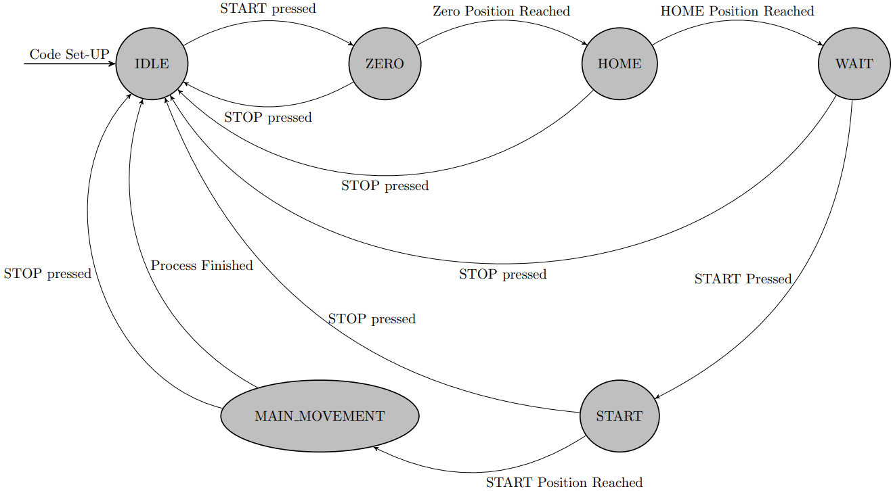

# Tr1-P1
Cartesian parallel manipulator, featuring "Tripteron" with 3 DoF, made as a student project for particular universitu course.
* Image of a robot:

  

    
  

# Motivation
The Tripteron project was born out of a practical need within the **EPIC** student research group: automating the preparation of metallographic specimens without breaking the bank.

Since professional, dedicated lab equipment is financially out of reach for most student budgets, this project delivers a cost-effective, simple to program, versatile alternative.

# Mechanical design

# Electronical design

# Programming
The system interfaces with three stepper motor drivers (X, Y, Z axes), dedicated limit switches (endstops) for homing, and control hardware.
The code architecture takes form of a state machine and it is described with this diagram:
  

    
  

  
Such architecture is described with one file, named: *stany.ino* written in the Arduino IDE for ESP32 DevBoard 

### Pin Mapping
| Component / Function | ESP32 Pin | Input / Output | Configuration / Description |
| :--- | :---: | :---: | :--- |
| **X-Axis STEP** | `GPIO22` | **OUTPUT** | Generates movement pulses for the X axis |
| **X-Axis DIR** | `GPIO23` | **OUTPUT** | Controls the direction of rotation for the X axis |
| **Y-Axis STEP** | `GPIO18` | **OUTPUT** | Generates movement pulses for the Y axis |
| **Y-Axis DIR** | `GPIO19` | **OUTPUT** | Controls the direction of rotation for the Y axis |
| **Z-Axis STEP** | `GPIO17` | **OUTPUT** | Generates movement pulses for the Z axis |
| **Z-Axis DIR** | `GPIO16` | **OUTPUT** | Controls the direction of rotation for the Z axis |
| **X-Axis Endstop** | `GPIO35` | **INPUT_PULLUP** | Limit switch for X home position |
| **Y-Axis Endstop** | `GPIO32` | **INPUT_PULLUP** | Limit switch for Y home position |
| **Z-Axis-bottom Endstop** | `GPIO33` | **INPUT_PULLUP** | Limit switch for Z home position |
| **Z-Axis-upper Endstop** | `GPIO25` | **INPUT_PULLUP** | Limit switch for Z home position |
| **START Button** | `GPIO14` | **INPUT_PULLUP** | Initiates the calibration and automation cycle |
| **STOP Button** | `GPIO12` | **INPUT_PULLUP** | Hardwired safety trigger for Emergency Stop |
---

#### State Descriptions:

* **`STATE_IDLE`** Remains stationary, actively polling the `START` button pin.
  
* **`STATE_HOMING`** Triggered after pressing START. Establishing the machine's absolute reference point.
  
* **`STATE_READY`** The homing was successfull. The parallel effector is calibrated at its home base, actively polling the `START` button pin.
  
* **`STATE_PROCESSING`** The system dynamically generates step pulses for all three axes simultaneously, executing predefined movement trajectory
  
* **`STATE_FINISHED`** The polishing cycle is complete. Retracts the effector away from the workpiece area, and transitions back to `STATE_IDLE` for the next run.
