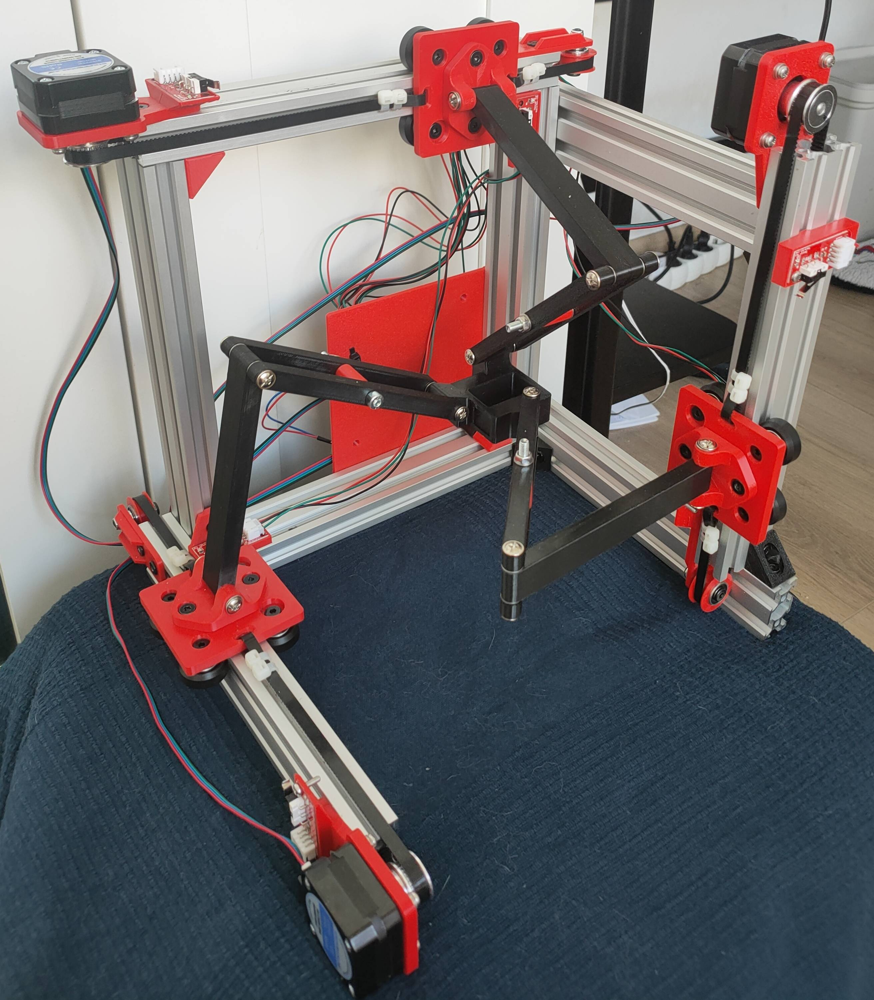

# Tr1-P1
Cartesian parallel manipulator, featuring "Tripteron" with 3 DoF, made as a student project for particular universitu course.
* Image of a robot:

  

    
  

# Motivation
The Tripteron project was born out of a practical need within the **EPIC** student research group: automating the preparation of metallographic specimens without breaking the bank.

Since professional, dedicated lab equipment is financially out of reach for most student budgets, this project delivers a cost-effective, simple to program, versatile alternative.

# Mechanical design

# Electronical design

# Programming

